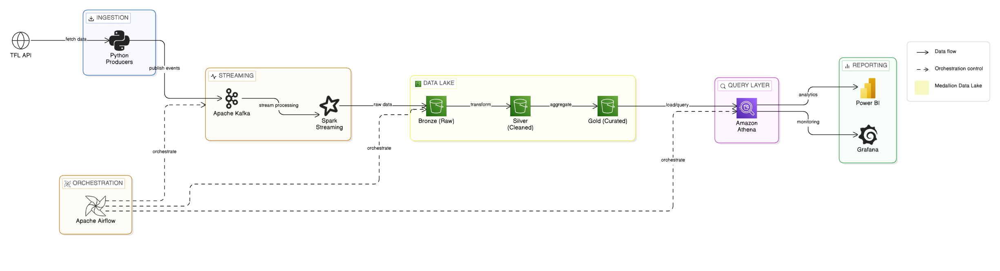
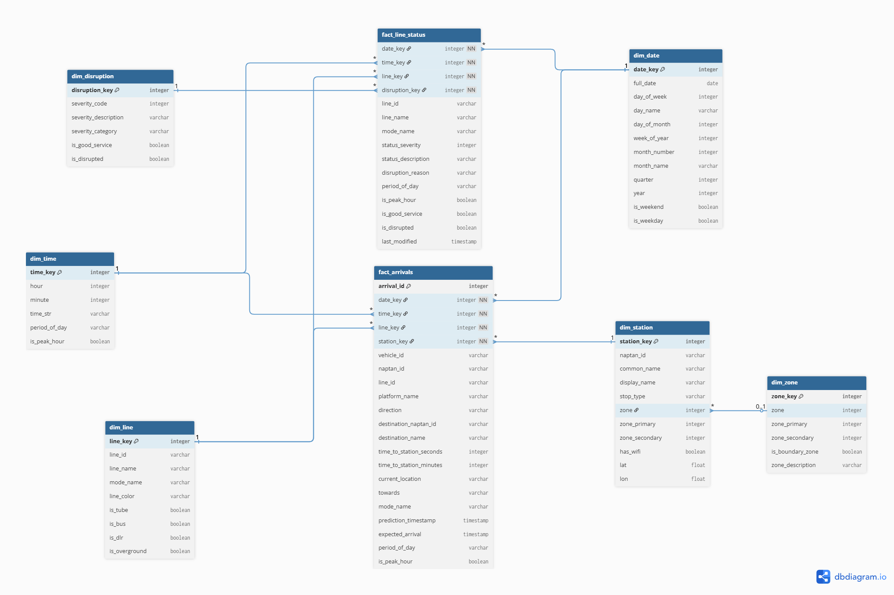

# TFL ETL Pipeline

> A cloud-native ETL pipeline ingesting real-time data from the **Transport for London (TFL) Unified API**, processed through a **Bronze → Silver → Gold** medallion architecture, and delivered to **Power BI** and **Grafana** dashboards.


---

## Architecture

<p align="center">
  
</p>


<br>
<br>
## Project Structure

```
tfl-etl-pipeline-project/
├── ingestion/           # Kafka producers — TFL API → Kafka topics
├── streaming/           # Spark Structured Streaming jobs
├── transformation/      # Bronze → Silver → Gold PySpark jobs
│   ├── schemas/         # Avro/Spark schema definitions
│   ├── silver/          # Cleaning & typing transformations
│   ├── gold/            # Dimension & fact table builders
│   └── utils/           # Shared Spark utilities
├── warehouse/           # Athena DDLs, views, and stored procedures
│   ├── schemas/
│   ├── dimensions/
│   ├── facts/
│   ├── views/
│   ├── stored_procedures/
│   └── seeds/
├── orchestration/       # Apache Airflow DAGs and custom operators
│   ├── dags/
│   └── plugins/
├── quality/             # Great Expectations suites and checkpoints
│   ├── suites/
│   └── checkpoints/
├── reporting/           # Power BI consumer & Grafana dashboards
│   └── dashboards/
├── infrastructure/      # Terraform IaC (AWS)
├── kafka/               # Kafka Connect configs & Grafana datasources
│   └── connectors/
├── jobs/                # Databricks job definitions (JSON)
├── config/              # Environment variable files & Airflow vars
├── tests/               # Unit and integration tests (pytest)
├── notebooks/           # Jupyter notebooks for exploration
├── data/                # Sample JSON payloads for local testing
├── docs/                # Architecture docs, API reference, runbooks
└── .github/workflows/   # CI/CD pipelines (GitHub Actions)
```

---

## Data Model

The Gold layer follows a **star schema** stored as Delta tables on S3 and queried via **Amazon Athena**.
<br>
<p align="center">
  
</p>
<br>
<br>
<!-- DATA MODEL SVG (fallback) -->
<p align="center">
<svg viewBox="0 0 860 520" xmlns="http://www.w3.org/2000/svg" width="860" font-family="monospace, sans-serif" font-size="13">

  <!-- Background -->
  <rect width="860" height="520" fill="#f8f9fb" rx="12"/>

  <!-- ── FACT: fact_arrivals (center) ── -->
  <rect x="300" y="190" width="260" height="155" rx="8" fill="#1a1a2e" stroke="#4a90d9" stroke-width="2"/>
  <rect x="300" y="190" width="260" height="30" rx="8" fill="#4a90d9"/>
  <rect x="300" y="208" width="260" height="12" fill="#4a90d9"/>
  <text x="430" y="211" text-anchor="middle" fill="white" font-weight="bold" font-size="13">fact_arrivals</text>
  <text x="316" y="238" fill="#a0c4e8" font-size="11">PK  arrival_id</text>
  <text x="316" y="254" fill="#a0c4e8" font-size="11">FK  date_key</text>
  <text x="316" y="270" fill="#a0c4e8" font-size="11">FK  time_key</text>
  <text x="316" y="286" fill="#a0c4e8" font-size="11">FK  line_key</text>
  <text x="316" y="302" fill="#a0c4e8" font-size="11">FK  station_key</text>
  <text x="316" y="318" fill="#a0c4e8" font-size="11">    expected_arrival</text>
  <text x="316" y="334" fill="#a0c4e8" font-size="11">    time_to_station</text>

  <!-- ── FACT: fact_line_status (bottom center) ── -->
  <rect x="300" y="400" width="260" height="95" rx="8" fill="#1a1a2e" stroke="#4a90d9" stroke-width="2"/>
  <rect x="300" y="400" width="260" height="30" rx="8" fill="#4a90d9"/>
  <rect x="300" y="418" width="260" height="12" fill="#4a90d9"/>
  <text x="430" y="421" text-anchor="middle" fill="white" font-weight="bold" font-size="13">fact_line_status</text>
  <text x="316" y="449" fill="#a0c4e8" font-size="11">PK  status_id</text>
  <text x="316" y="465" fill="#a0c4e8" font-size="11">FK  date_key  ·  FK  line_key</text>
  <text x="316" y="481" fill="#a0c4e8" font-size="11">FK  disruption_key</text>

  <!-- connector: fact_arrivals → fact_line_status -->
  <line x1="430" y1="345" x2="430" y2="400" stroke="#4a90d9" stroke-width="1.5" stroke-dasharray="4"/>

  <!-- ── DIM: dim_date (top center) ── -->
  <rect x="310" y="30" width="240" height="100" rx="8" fill="#0f3460" stroke="#e94560" stroke-width="1.5"/>
  <rect x="310" y="30" width="240" height="28" rx="8" fill="#e94560"/>
  <rect x="310" y="46" width="240" height="12" fill="#e94560"/>
  <text x="430" y="49" text-anchor="middle" fill="white" font-weight="bold" font-size="13">dim_date</text>
  <text x="326" y="76" fill="#d0e4f7" font-size="11">PK  date_key</text>
  <text x="326" y="92" fill="#d0e4f7" font-size="11">    day · week · month · quarter</text>
  <text x="326" y="108" fill="#d0e4f7" font-size="11">    is_weekend · is_holiday</text>
  <!-- connector dim_date → fact_arrivals -->
  <line x1="430" y1="130" x2="430" y2="190" stroke="#e94560" stroke-width="1.5"/>
  <polygon points="430,190 425,180 435,180" fill="#e94560"/>

  <!-- ── DIM: dim_time (top right) ── -->
  <rect x="600" y="30" width="220" height="100" rx="8" fill="#0f3460" stroke="#e94560" stroke-width="1.5"/>
  <rect x="600" y="30" width="220" height="28" rx="8" fill="#e94560"/>
  <rect x="600" y="46" width="220" height="12" fill="#e94560"/>
  <text x="710" y="49" text-anchor="middle" fill="white" font-weight="bold" font-size="13">dim_time</text>
  <text x="616" y="76" fill="#d0e4f7" font-size="11">PK  time_key</text>
  <text x="616" y="92" fill="#d0e4f7" font-size="11">    hour · minute · period</text>
  <text x="616" y="108" fill="#d0e4f7" font-size="11">    rush_hour_flag</text>
  <!-- connector dim_time → fact_arrivals -->
  <line x1="600" y1="90" x2="560" y2="260" stroke="#e94560" stroke-width="1.5"/>
  <polygon points="560,260 553,250 563,250" fill="#e94560"/>

  <!-- ── DIM: dim_line (left) ── -->
  <rect x="30" y="170" width="210" height="100" rx="8" fill="#0f3460" stroke="#e94560" stroke-width="1.5"/>
  <rect x="30" y="170" width="210" height="28" rx="8" fill="#e94560"/>
  <rect x="30" y="186" width="210" height="12" fill="#e94560"/>
  <text x="135" y="189" text-anchor="middle" fill="white" font-weight="bold" font-size="13">dim_line</text>
  <text x="46" y="216" fill="#d0e4f7" font-size="11">PK  line_key</text>
  <text x="46" y="232" fill="#d0e4f7" font-size="11">    name · mode · colour</text>
  <text x="46" y="248" fill="#d0e4f7" font-size="11">    is_active</text>
  <!-- connector dim_line → fact_arrivals -->
  <line x1="240" y1="250" x2="300" y2="270" stroke="#e94560" stroke-width="1.5"/>
  <polygon points="300,270 288,268 292,258" fill="#e94560"/>

  <!-- ── DIM: dim_station (right) ── -->
  <rect x="620" y="185" width="210" height="115" rx="8" fill="#0f3460" stroke="#e94560" stroke-width="1.5"/>
  <rect x="620" y="185" width="210" height="28" rx="8" fill="#e94560"/>
  <rect x="620" y="201" width="210" height="12" fill="#e94560"/>
  <text x="725" y="204" text-anchor="middle" fill="white" font-weight="bold" font-size="13">dim_station</text>
  <text x="636" y="231" fill="#d0e4f7" font-size="11">PK  station_key</text>
  <text x="636" y="247" fill="#d0e4f7" font-size="11">    name · zone</text>
  <text x="636" y="263" fill="#d0e4f7" font-size="11">    latitude · longitude</text>
  <text x="636" y="279" fill="#d0e4f7" font-size="11">    naptan_id</text>
  <!-- connector dim_station → fact_arrivals -->
  <line x1="620" y1="255" x2="560" y2="300" stroke="#e94560" stroke-width="1.5"/>
  <polygon points="560,300 553,289 563,291" fill="#e94560"/>

  <!-- ── DIM: dim_zone (bottom left) ── -->
  <rect x="30" y="390" width="200" height="85" rx="8" fill="#0f3460" stroke="#e94560" stroke-width="1.5"/>
  <rect x="30" y="390" width="200" height="28" rx="8" fill="#e94560"/>
  <rect x="30" y="406" width="200" height="12" fill="#e94560"/>
  <text x="130" y="409" text-anchor="middle" fill="white" font-weight="bold" font-size="13">dim_zone</text>
  <text x="46" y="436" fill="#d0e4f7" font-size="11">PK  zone_key</text>
  <text x="46" y="452" fill="#d0e4f7" font-size="11">    zone_number · zone_name</text>
  <text x="46" y="465" fill="#d0e4f7" font-size="11">    pricing_band</text>

  <!-- ── DIM: dim_disruption (bottom right) ── -->
  <rect x="630" y="390" width="200" height="85" rx="8" fill="#0f3460" stroke="#e94560" stroke-width="1.5"/>
  <rect x="630" y="390" width="200" height="28" rx="8" fill="#e94560"/>
  <rect x="630" y="406" width="200" height="12" fill="#e94560"/>
  <text x="730" y="409" text-anchor="middle" fill="white" font-weight="bold" font-size="13">dim_disruption</text>
  <text x="646" y="436" fill="#d0e4f7" font-size="11">PK  disruption_key</text>
  <text x="646" y="452" fill="#d0e4f7" font-size="11">    type · severity</text>
  <text x="646" y="465" fill="#d0e4f7" font-size="11">    description</text>

  <!-- Legend -->
  <rect x="30" y="30" width="130" height="60" rx="6" fill="#1a1a2e" stroke="#555" stroke-width="1"/>
  <rect x="42" y="44" width="14" height="10" rx="2" fill="#4a90d9"/>
  <text x="62" y="53" fill="#ccc" font-size="11">Fact table</text>
  <rect x="42" y="62" width="14" height="10" rx="2" fill="#e94560"/>
  <text x="62" y="71" fill="#ccc" font-size="11">Dimension table</text>

</svg>
</p>

| Table | Description |
|---|---|
| `dim_date` | Calendar dimension — day, week, month, quarter, holiday flags |
| `dim_time` | Time-of-day dimension — hour, minute, period, rush-hour flag |
| `dim_line` | TFL line master — name, mode, colour, active status |
| `dim_station` | Station master — name, zone, coordinates, NaPTAN ID |
| `dim_zone` | Fare zone — number, name, pricing band |
| `dim_disruption` | Disruption type and severity |
| `fact_arrivals` | Vehicle arrival events with timing metrics |
| `fact_line_status` | Line status snapshots over time |

---

## Quick Start

### Prerequisites

| Tool | Version |
|---|---|
| Python | ≥ 3.10 |
| Apache Kafka | ≥ 3.x |
| Apache Spark | ≥ 3.4 |
| Apache Airflow | ≥ 2.7 |
| Terraform | ≥ 1.5 |
| Docker & Docker Compose | latest |

### 1 — Clone & install

```bash
git clone https://github.com/your-org/tfl-etl-pipeline-project.git
cd tfl-etl-pipeline-project
pip install -r requirements.txt
```

### 2 — Configure environment

```bash
cp config/dev.env .env
# Set: TFL_API_KEY, AWS_ACCESS_KEY_ID, AWS_SECRET_ACCESS_KEY,
#      KAFKA_BOOTSTRAP_SERVERS, ATHENA_DATABASE, ATHENA_S3_OUTPUT
```

### 3 — Start local infrastructure

```bash
docker-compose up -d   # Kafka, Zookeeper, Airflow, Postgres
```

### 4 — Run ingestion producers

```bash
python ingestion/arrivals_producer.py
python ingestion/line_status_producer.py
python ingestion/bikepoint_producer.py
```

### 5 — Deploy Kafka Connect S3 sink

```bash
curl -X POST http://localhost:8083/connectors \
     -H "Content-Type: application/json" \
     -d @kafka/connectors/s3_sink_arrivals.json
```

### 6 — Submit Spark Streaming job

```bash
spark-submit streaming/streaming_arrivals.py
```

### 7 — Trigger Airflow DAGs

Open `http://localhost:8080` and trigger:

| DAG | Purpose |
|---|---|
| `tfl_etl_pipeline` | Main pipeline |
| `tfl_dimensions_refresh` | Refresh dimension tables |
| `tfl_data_quality` | Run Great Expectations checks |

### 8 — Provision AWS infrastructure

```bash
cd infrastructure/
terraform init
terraform plan  -var-file=dev.tfvars
terraform apply -var-file=dev.tfvars
```

---

## Data Quality

Great Expectations suites live in `quality/suites/`. Checkpoints are triggered by the `tfl_data_quality` Airflow DAG.

```bash
# Run checks manually
python quality/pipeline_health_check.py
```

---

## Tests

```bash
pytest tests/ -v                        # all tests
pytest tests/test_producers.py          # ingestion
pytest tests/test_spark_jobs.py         # transformations
pytest tests/test_kafka_pipeline.py     # pipeline integration
```

---

## CI/CD

| Workflow | File | Trigger |
|---|---|---|
| Lint & Test | `.github/workflows/ci.yml` | Every PR |
| Deploy Dev | `.github/workflows/cd_dev.yml` | Merge to `develop` |
| Deploy Prod | `.github/workflows/cd_prod.yml` | Merge to `main` |

---

## Environments

| Environment | Config | Terraform vars |
|---|---|---|
| Development | `config/dev.env` | `infrastructure/dev.tfvars` |
| Staging | `config/staging.env` | `infrastructure/staging.tfvars` |
| Production | `config/prod.env` | `infrastructure/prod.tfvars` |

---

## Troubleshooting

### Kafka producer fails to connect

- Verify `KAFKA_BOOTSTRAP_SERVERS` in `.env` is reachable.
- Check Zookeeper is healthy: `docker-compose ps`.
- Confirm the topic exists: `kafka-topics.sh --list --bootstrap-server localhost:9092`.

### Spark job exits with `ClassNotFoundException`

- Ensure the correct Kafka/S3 JARs are on the classpath.
- Add `--packages org.apache.spark:spark-sql-kafka-0-10_2.12:3.4.0` to your `spark-submit` command.

### Athena query returns no results

- Check the S3 path in your Athena table DDL matches the actual Bronze/Gold prefix.
- Run `MSCK REPAIR TABLE <table_name>;` to refresh partition metadata.
- Verify the IAM role attached to Athena has `s3:GetObject` on the data bucket.

### Airflow DAG stuck in `running` state

- Check worker logs: `docker-compose logs airflow-worker`.
- Ensure all Airflow connections (`aws_default`, `spark_default`) are configured under **Admin → Connections**.

### Great Expectations checkpoint fails

- Inspect the HTML report generated in `quality/uncommitted/data_docs/`.
- Null counts or schema mismatches usually point to an upstream producer change — verify the TFL API response schema.

### Terraform apply errors on first run

- Run `terraform init` before `plan`/`apply`.
- Ensure your AWS credentials have sufficient permissions (IAM, S3, Glue, Athena).
- For state-lock errors: `terraform force-unlock <lock-id>`.

---

## Documentation

| Document | Description |
|---|---|
| [API Reference](docs/api_reference.md) | TFL API endpoints and schemas |
| [Data Dictionary](docs/data_dictionary.md) | Field-level descriptions for all tables |
| [Onboarding Guide](docs/onboarding.md) | New developer setup |
| [Runbook](docs/runbook.md) | Operational runbook for incidents |
| [Architecture Diagram](docs/architecture_diagram.drawio) | Editable Draw.io diagram |

---

## Contributing

1. Fork the repository
2. Create a feature branch: `git checkout -b feature/my-feature`
3. Run tests: `pytest tests/ -v`
4. Commit: `git commit -m 'feat: add my feature'`
5. Open a Pull Request

---

## License

This project is licensed under the [MIT License](LICENSE).

---

*Built with Apache Kafka · Apache Spark · Apache Airflow · AWS · Amazon Athena · Terraform · Great Expectations*
